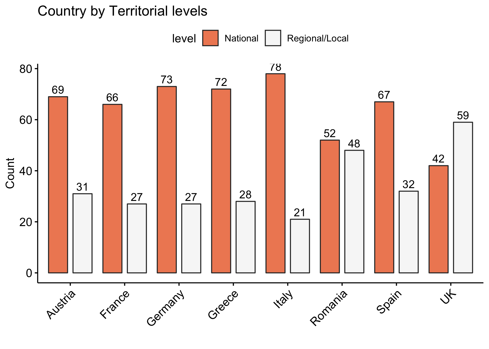
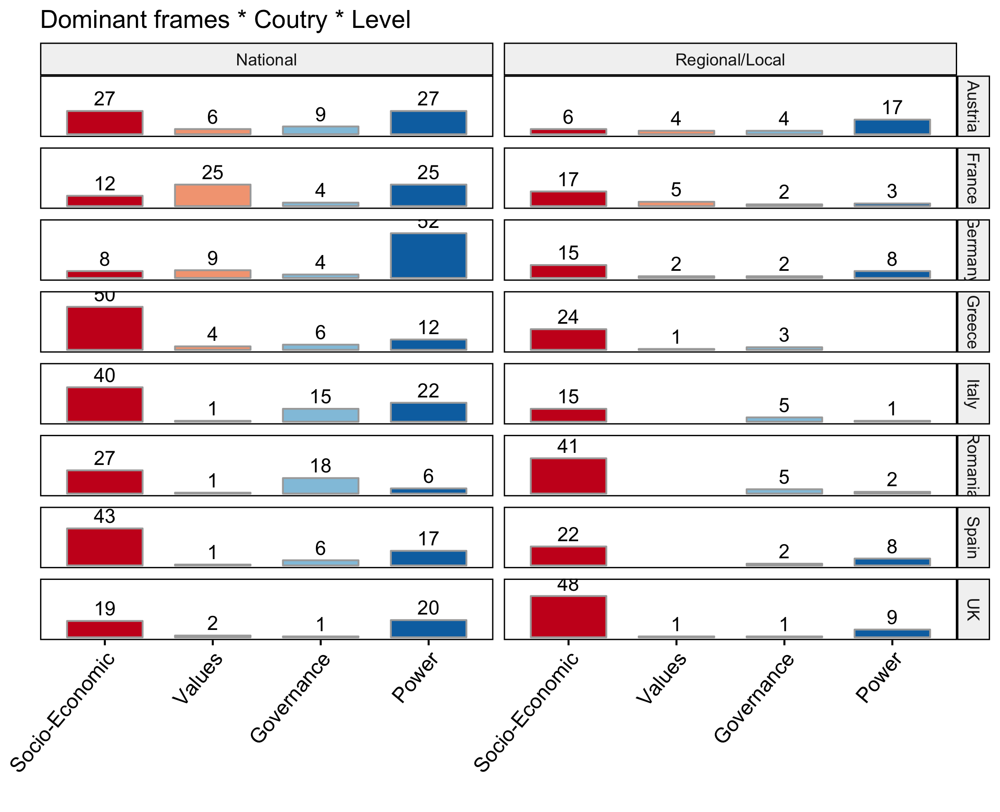
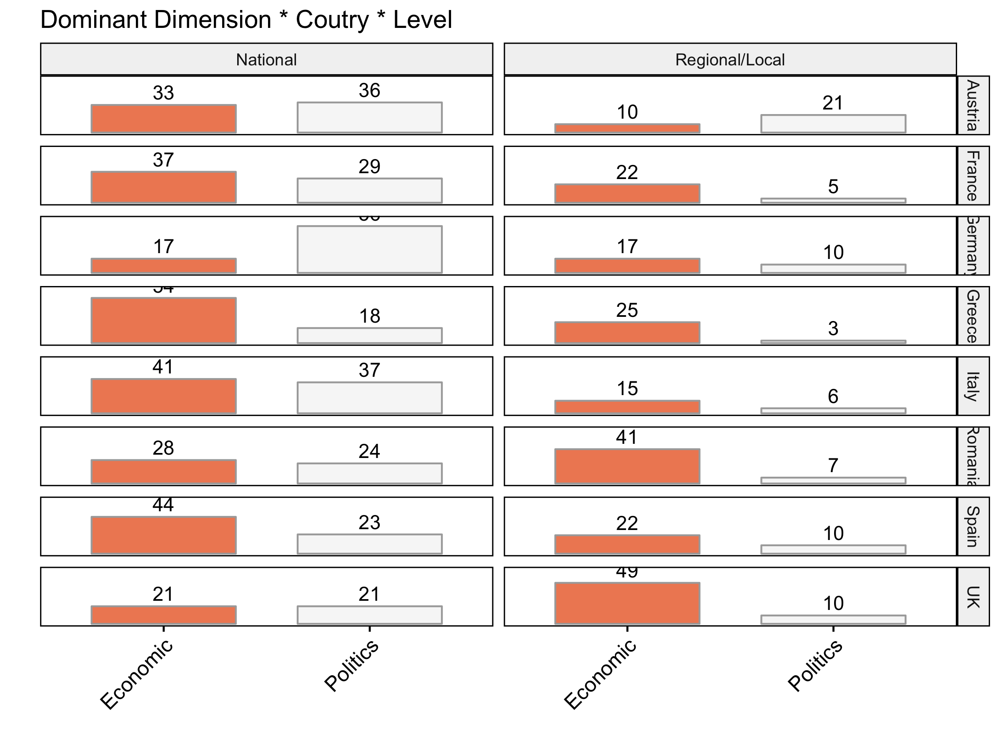
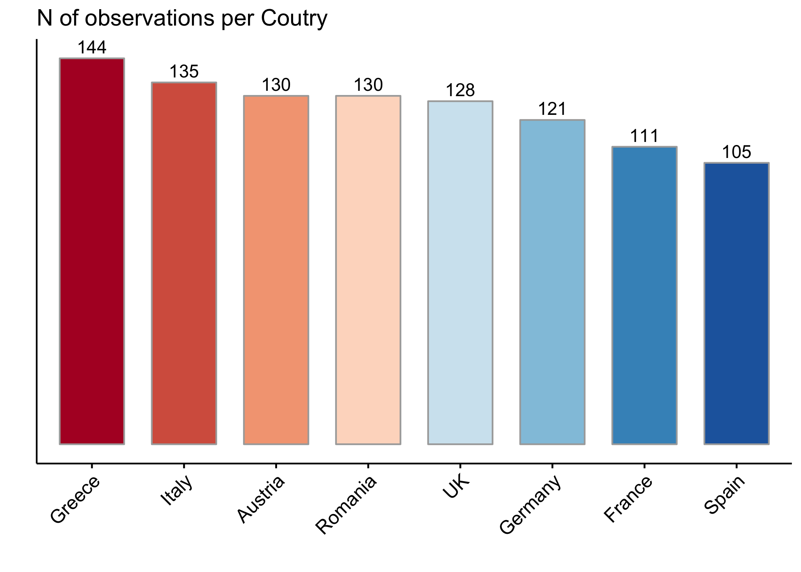
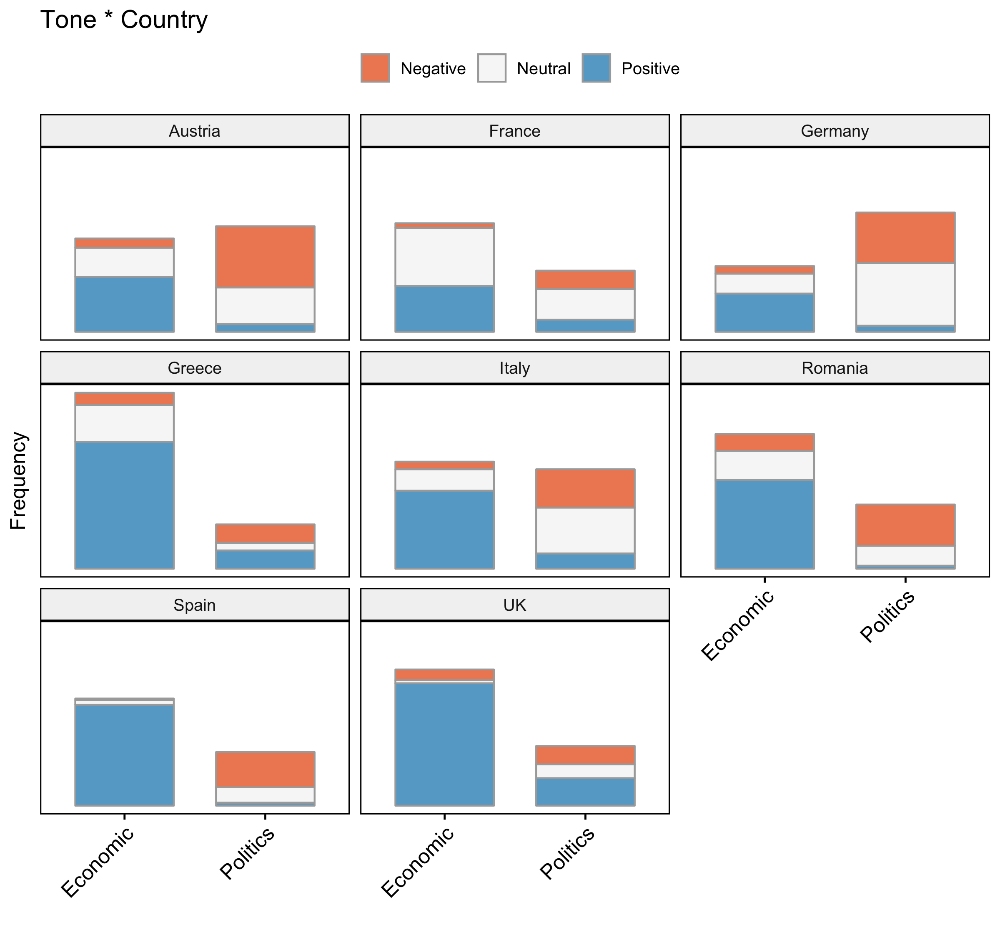
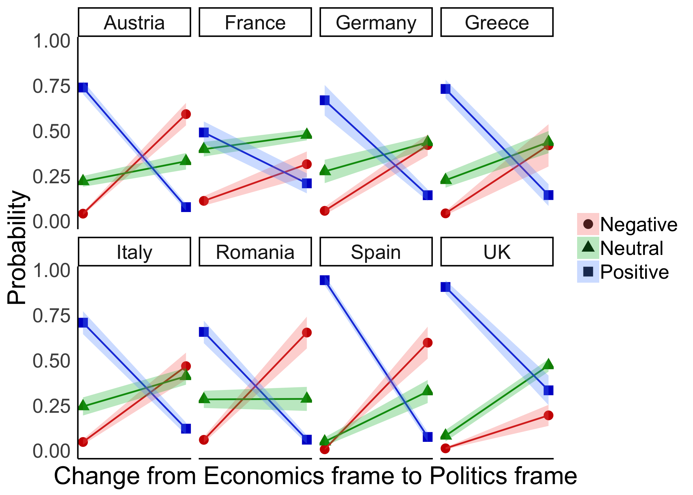
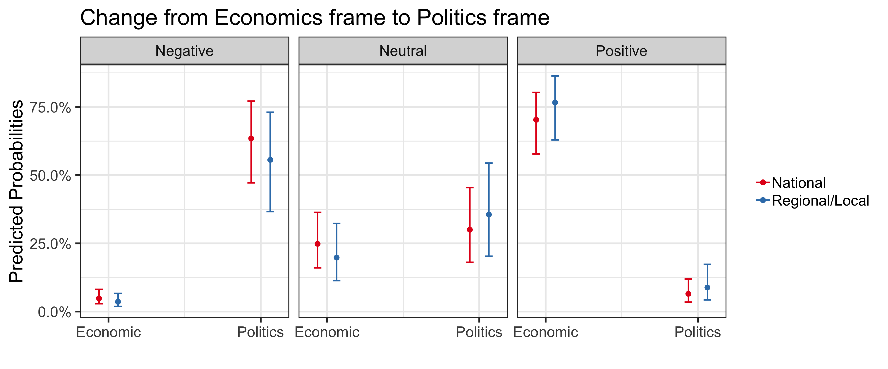
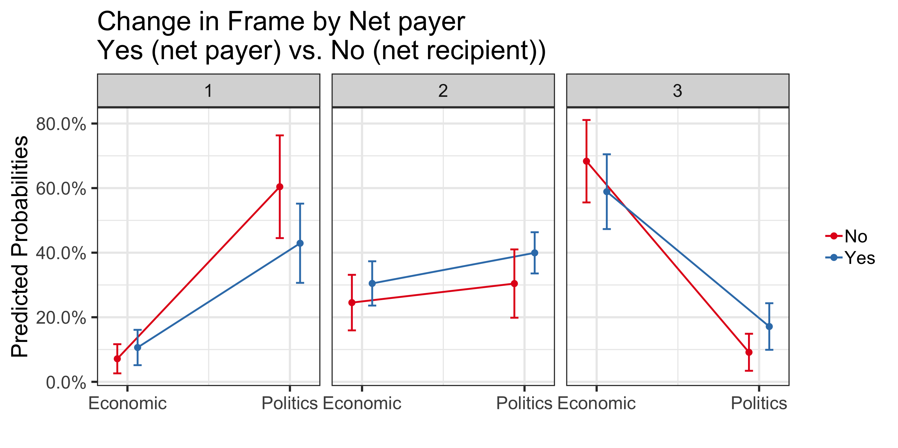

```{r setup, include=FALSE}
knitr::opts_chunk$set(message=FALSE,warning=FALSE, cache=TRUE)
```
<br/><br/>

# Overall conceptualisation
Lorem ipsum dolor sit amet, consectetur adipiscing elit, sed do eiusmod tempor incididunt ut labore et dolore magna aliqua. Ut enim ad minim veniam, quis nostrud exercitation ullamco laboris nisi ut aliquip ex ea commodo consequat. Sed do eiusmod tempor incididunt ut labore et dolore magna aliqua.
<br/><br/>

# Key hypotheses
1. Lorem ipsum dolor sit amet  
2. Consectetur adipiscing elit. 
3. Sed do eiusmod tempor incididunt ut labore et dolore magna aliqua. Ut enim ad minim veniam, quis nostrud exercitation ullamco laboris nisi ut aliquip ex ea commodo consequat.  
4. Sed do eiusmod tempor incididunt ut labore et dolore magna aliqua.
<br/><br/>


# Descriptives I (Cross-country)
There’s an issue with the cell count for the Regional level, which is accentuated when including the Dominant frames (see next section). 

{#id .class width=80% height=80%}


<br/><br/>

# Descriptives II (Frames)
There an issue with cell count when disaggregation of the Frames by country and level is explored. 

{#id .class width=80% height=80%}

To overcome the problem of low or missing cell count we can reconceptualise at a higher level. The re-conceptualiastion, around Economics (socio-economic & values) vs Politics (governance & power), still fits concpetually while highlighting the overall problematique nicely: the Politics versus the Economics of CP.


{#id .class width=80% height=80%}

<br/><br/>

# Descriptives: Dependent variables (Tone & Europeanization)
Both dependent variables are probablyt OK in terms of their distribution across the different groups of interest (although the lower regional level does have a very low count, especially the Tone variable. Europeanization has a slightly better distribution across categories.


#### <a href="https://fmendez72.github.io/regio/analysis/descriptives3.html" target="_blank">More on Tone and Europeanization by country</a>
<br/><br/>

# Descriptives: Stacked data format
Stacking the data marginally improves the cell count across outcomes of interest -not by a great amount. The main issue with stacking could be the case of Spain, and to a somewhat lesser extent France. 

The number of additional subframes for countries is rather low. In most cases around 30% of cases had multiple subframes (and in Greece ~ 44%). However, in Spain it was only 6 extra stories (~ 6%). Spain, and France, seem to have been coded differently to the rest.  

{#id .class width=70% height=70%}
 <br/><br/>
The other obvious things that emerges is that you don't need regression analysis to realise that Frames drive Tone -it seems to be true by defintion or the relation of ideas.

{#id .class width=80% height=80%}

This shows that Economics is positive, while Politics is negative -this is going to come out very strongly in any regression. 

#### <a href="https://fmendez72.github.io/regio/analysis/descriptivesLong.html" target="_blank">More descriptives on the stacked data summaries</a>
<br/><br/>

# Methodology 
The dependent variables are ordered, Tone on a three-point scale (negative, neutral, positive), while Europeanization is also on a three-point scale (no Europeanization, medium-Europeanisation and high Europeanisation). 

Another element of the data is that has a nested structure: subframes > stories > sites > country. However,  the subframes > stories part nesting element is a bit problematic.

Give the data structure we fit an mixed effects Ordinal regression. The latter can handle the nested structure. We have [Country | Website] random effects and fixed effects for the core variables of interest. 

<br/><br/>


# Modeling 1 (Determinants of Tone unstacked data)
First we fit a regular ordinal regression. All the details are in the link below. The basic story is that once you include Frames in the model, this variable drives everything. Indeed, all that is needed in the model is Frames and Country.

The interaction effect is shown below for the best model. It clearly shows what happens to the predicted probabilities from a shift from Economic frame to Politics frame on the x axis. It all looks quite similar -so adding country level attributes (rich vs. poor, big vs small) is unlikely to have much of an impact. Including Frames * Country is likely to always be the best mode in any set up. 

{#id .class width=70% height=70%}

 <br/><br/>

Evidently, it is possible to find signficant interactions when including Frame, such as the one below. The Frame*Level interaction is signficant. But there's no real difference between the territorial levels as can be seen below (the effects are between Frames rather than territorial levels). Interactions need to be graphed to see what's going on, and here there's not much going on between territorial levels. 

{#id .class width=90% height=90%}

#### <a href="https://fmendez72.github.io/regio/analysis/model1.html" target="_blank">See details of modeling 1 (unstacked data)</a>
<br/><br/>

# Modeling 2 (Determinants of Tone stacked data)
Here we fit a mixed effects ordinal regression. There is a lot more going on in the analysis so this has to be read more carefully in the link below. Nonetheless, the basic point remains that further thought is needed on potential country attributes to include in the model when country patterns are by and large very similar (as can be seen in the country interaction plot above).

Here is an example of a better model that includes a Net Payer interaction, which is significant. But goes the wrong way theoretically - that is net recipients are more likely to be negative (panel 1), and marginally less positive (3).

{#id .class width=90% height=90%}


#### <a href="https://fmendez72.github.io/regio/analysis/model2.html" target="_blank">See modeling 2 analysis</a>
<br/><br/>

# Modeling 3
Here we go for a simple model to test Level more explictly. Click on link below to see results of analysis.
<br/><br/>

#### <a href="https://fmendez72.github.io/regio/analysis/model3.html" target="_blank">See modeling 2 analysis</a>
<br/><br/>
