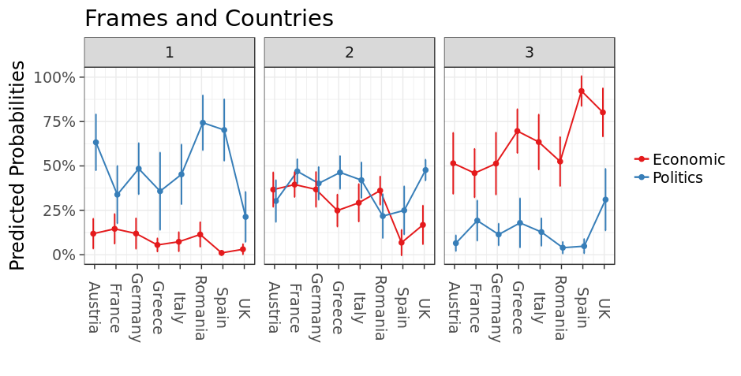

```{r setup, include=FALSE}
knitr::opts_chunk$set(echo = FALSE)
```


```{r,echo=FALSE,message=FALSE}
library(foreign)
library(dplyr)
library(ggplot2)
library(ggpubr)
library(scales)
library(tidyr)
library(stringr)
library(reshape2)
library(knitr)
library(kableExtra)
library(stringr)

library(ordinal)
library(stargazer)
```


```{r,echo=FALSE,message=FALSE,warning=FALSE}
# Prepare dataframe
library(dplyr)

load("dfFull.Rdata")
df=dfFull
df= df %>% mutate_all(na_if,"")

# Fix date
df=df %>% 
  mutate(date2=as.Date(date,format = "%Y-%m-%d"),
         year=str_extract(date, "^.{4}"),
         year2=year,
         year2=as.numeric(recode(year2, `2014`="1",`2015`="1",`2016`="2",`2017`="2",`2018`="3",`2019`="3")),
         dim=as.character(domFrame),
         dim=as.factor(recode(domFrame,
                    `Socio-Economic`="Economic",
                    `Values`="Economic",
                    `Governance`="Politics",
                    `Power`="Politics")))

dfTone=df %>% select(id0,tone1,tone2,tone3) %>% 
  melt(id="id0") %>% 
  rename(Tone=value)

dfSub=df %>% select(id0,subFrame1,subFrame2,subFrame3) %>% 
  melt(id="id0") %>% 
  select(value) %>% 
  rename(Subframe=value)

dfActor=df %>% select(id0,actor1,actor2,actor3) %>% 
  melt(id="id0") %>% 
  select(value) %>% 
  rename(Actor=value)

dfMyth=df %>% select(id0,myth1,myth2,myth3) %>% 
  melt(id="id0") %>% 
  select(value) %>% 
  rename(Myth=value)


dfl=cbind(dfTone,dfSub,dfActor,dfMyth)
dfl=dfl %>% 
  arrange(id0)

dfw=df %>% 
  select(id0,country,NetPayer,level,Europ,site,sourceType,
         sourceFormat,sourceLevel,wordN,searchTerm,
         date,date2,year,year2,dim,domTone2,vis,vis2)

dfl=merge(dfl,dfw,by="id0",all.x = TRUE,sort = F)


dfl=dfl %>% 
  mutate(Tone=as.factor(Tone),
    Tone=recode_factor(Tone, `Negative` = "Negative", 
                       `Balanced` = "Neutral", 
                       `Factual` = "Neutral",
                       `Positive` = "Positive",
                       .ordered = TRUE),
                       id0=factor(id0))
dfl=droplevels(dfl)
dfl=subset(dfl,!is.na(Tone))
df=dfl

```


```{r}
# Further preprocessing
df=subset(df,!is.na(date2))

df$vis4=recode_factor(df$vis, `very low`="v.low",
                      `low`="low-medium",
              `medium`="low-medium",
              `high`="high-very high",
              `very high`="high-very high",.ordered = TRUE)

df$level=recode_factor(df$level, `Regional/Local`="Regional")

df$words=cut(df$wordN,
         breaks = c(0,500,1000,Inf),
         labels=c("<500","500-1000","+1000"))

```

## Preprocessing

A few tweaks had to be made to some predictors -namely word count, that was making the model unstable. Basically, it was recoded to 500 words, 500-1000 words or above 1000 words. This all makes sense and makes it more interpretable than saying a change of 1 word has X effect on the probability. The variable is called "words". 

Also, visibility -which was very skewed- has 3 categories with a much better distribution: 

1. Very low  
2. Low to medium  
3. High/Very high

Visibility is called "vis4" in the models.

Let's start with a few story level predictors in a mixed effects ordinal regression.

## Model 1
```{r}
m1 = clmm(Tone ~ vis4 + words + year2 + sourceFormat + (1|country) + (1|site),
          Hess = TRUE,
          data = df,
          threshold = "flexible")
```

#### Summary

In the summary output, the main coefficients are the fixed effects.

In the summary output, you can see the model specification the formula line. 

We can see that only "words" and "vis4" are signficant. "vis4" is ordinaly, and it's the change from Very Low to Low-Medium that is significant.

```{r,comment=""}
summary(m1)
```


## Model 2

In model 2 we'll add some country attributes (Netpayer and Level). We can see that only Level appears to be signficiant.
```{r}
m2 = clmm(Tone ~ level + NetPayer + 
            vis4 + words + year2 + sourceFormat + (1|country) + (1|site), 
          Hess = TRUE,
          data = df,
          threshold = "flexible")

```

### Summary model 2
```{r,comment=""}
summary(m2)
```


## Model 3
In model 3 we will now add the Frames variable (Economics vs Politics frame), called "dim" in the model.  
```{r,comment=""}
m3 = clmm(Tone ~ dim + level + NetPayer + 
            vis4 + words + year2 + sourceFormat +  (1|country) + (1|site), 
          Hess = TRUE,
          data = df,
          threshold = "flexible")

```

### Summary model 3

Here we can see the effect of including Frames. It has a huge coefficient. Moving from an Economics frame to Politics frame is nearly 15 times more likely to be associated with negative tone (that's the odds ratio for a logit value of ~2.7).

We can also see that virtually everything else drops out.
```{r,comment=""}
summary(m3)
```


## Model 4

Let's add some interaction effects to the model. This can be seen in the summary output below.

```{r,comment=""}
m4 = clmm(Tone ~ dim * (level + NetPayer + words + vis4) + year2 + sourceFormat + (1|country) + (1|site), 
          Hess = TRUE,
          data = df,
          threshold = "flexible")

```

### Summary model 4

Here we can see most interqaction effects are signficant. Probably because of the powerful effect of the Frame. 
```{r,comment=""}
summary(m4)
```

Is the complicated model Model 4 better than Model 3. The model 4 AIC is lower than model 3. The anova comparison of models suggest they are significantly different, leading us to prefer Model 4.

```{r,comment=""}
anova(m3, m4)
```


## Explore Model 4

Let's re-fit model 4 by removing the variables that didn't add anything (essentially sourceFormat and year) add some interaction effects to the model. 

```{r,comment=""}
m4 = clmm(Tone ~ dim * (level + NetPayer + words + vis4) + (1|country), Hess = TRUE,
          data = df,
          threshold = "flexible")

```

### Visualise interactions
```{r}
library(ggeffects)
```

There were 3 significant interactions. Let's see what kind of impact they have. Note in the graphs below 1=Negative; 2=Neutral and 3=Positive.

#### Frames * Level

Here we can see the effect on the predicted probabilities of changing from an Economic frame to a Politics frame on the 3 levels of the Tone variable. 

It's hard to see what's happening -probably not too much. Certainly not in the middle category. For negative (1) and positive (3) the move to a Politics frames is to be more likely to be negative for national level than regional. But this is all within the confidence intervals. So it's not a really visible difference.  


```{r,message=FALSE,fig.width=10}
ggpredict(m4, c("dim","level")) %>% plot(connect.lines=TRUE) +
  ylab("Predicted Probabilities") +
  xlab("") +
  theme_bw(base_size = 18) +
  theme(legend.title = element_blank()) +
  ggtitle("Change in Frame by territorial level") 

```

#### Frames * Net Payer

Here we can see the effect on the predicted probabilities of changing from an Economic frame to a Politics frame on the 3 levels of the Tone variable by focusing on the Net Payer interaction. This was one of the stronger effects. 

This is a somewhat similar picture to level. Again, not much happening in the neutral category (2). However, for negative (1) and positive (3) the move to a Politics frames seems more likely to be negative for net receivers than for net payers. When looking at the politics frames, the net receivers have a lower likelihood of being positive.

It should be noted that these probabilities don't reveal much; there's a marginal difference between groups but they are all in similar ranges.


```{r,message=FALSE,fig.width=10}
ggpredict(m4, c("dim","NetPayer")) %>% plot(connect.lines=TRUE) +
  ylab("Predicted Probabilities") +
  xlab("") +
  theme_bw(base_size = 18) +
  theme(legend.title = element_blank()) +
  ggtitle("Change in Frame by Net payer (Yes/No)") 

```


#### Frames * Words

Here is the less interesting one. We can see there's not much difference on the Politics side. They kind of converge. Probably the effect is being driven by the differences on the Economic frame, and the positive (2) panel in particular. Basically, shorter Economic frames are more likely to be postive than longer articles. 


```{r,message=FALSE,fig.width=10}
ggpredict(m4, c("dim","words")) %>% plot(connect.lines=TRUE) +
  ylab("Predicted Probabilities") +
  xlab("") +
  theme_bw(base_size = 18) +
  theme(legend.title = element_blank()) +
  ggtitle("Change in Frame by article length") 

```

#### Frames * Visibility

Last interaction is the visbility one. It's not clear what's happening, and this is in any case not of much interest as a variable.

```{r,message=FALSE,fig.width=10}
ggpredict(m4, c("dim","vis4")) %>% plot(connect.lines=TRUE) +
  ylab("Predicted Probabilities") +
  xlab("") +
  theme_bw(base_size = 18) +
  theme(legend.title = element_blank()) +
  ggtitle("Change in Frame by article length") 

```


## Model 5 A quick check on an alternative

Let's re-fit model 4 with country instead of Net Payer we'll use the country variable to see how this is driving the results.

You can see how country is being driven by Spain.
```{r,comment=""}
m5 = clmm(Tone ~ dim * (level + country + words + vis4) + (1|country) + (1|site), Hess = TRUE,
          data = df,
          threshold = "flexible")

summary(m5)
```

When graphing the effects, you can clearly see the impact of Spain. Basically, on the positive tone Spain has virtually certain predicted probabilities for being or not being positive.



### Compare model 4 with model 5

Model 5 is significantly better than model 4.
```{r}
anova(m4,m5)
```

Indeed, you can just have a model with 2 variables Frame *X* Country that would outperform all models except for model 5.


# Summary

It's easy to find significant coefficients in saturated regression models. The difficulty is making sense of them. Graphing helps here when interaction effects are at play. Yet in all these models the Frames overwhelm all others effects. The other significant factor is that country, or rather certain countries, matter.
