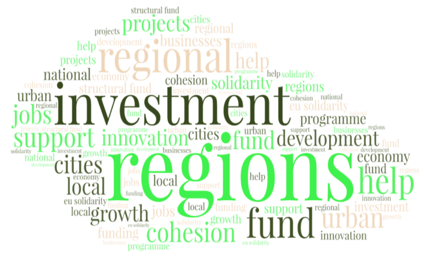

# **Regio project website**

This website contains various project resources. The project analyzes the tone and the level of Europeanization in media stories related to Cohesion policy based on our framing analysis framework.   

## How to use  

1. See the [Analysis](https://fmendez72.github.io/regio/ExploratoryAnalysis.html) tab for preliminary exploratory analysis. 

2. The [Links page](https://fmendez72.github.io/regio/Links.html) contains helpful links related to data analysis.  

3. Throught the project we wil be adding features and tabs to this website as the project develops.

### [Framing Cohesion policy: An extended cross-country analysis](https://fmendez72.github.io/regio/)

